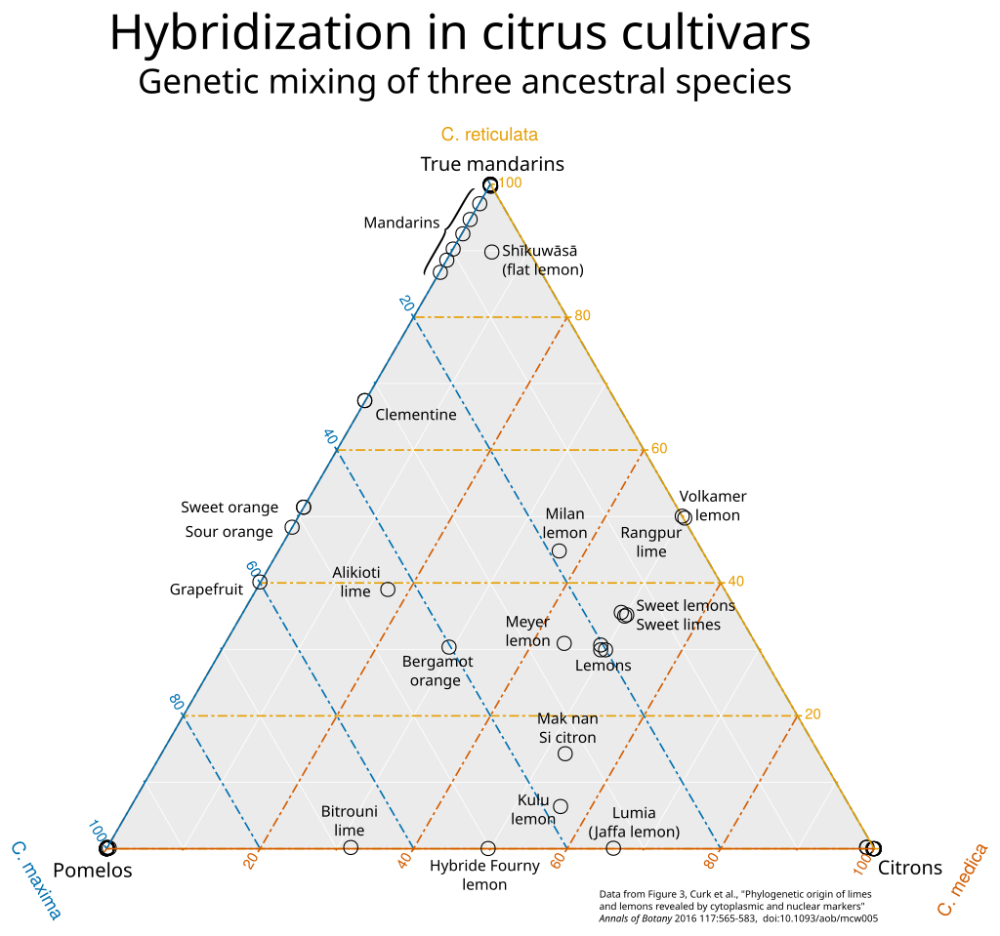

The medication I'm taking for insomnia interacts badly with grapefruit juice. This isn't much of a issue, yet; the cravings are still manageable. I only dream about grapefruit sometimes. The biggest problem, really, is that a mischievous imp or demon has been going around replacing all of the nonalcoholic drinks at every Bay Area house party with grapefruit Spindrift and *pamplemousse* LaCroix.

The most common reaction I get, when I bring this up, is "oh yeah, I [had/have] to avoid grapefruit because I [was/am] taking [medication]", with a different medication every time.

What's up with that?

## Furanocoumarins, CPY3A4, and you

There are a handful of cytochrome P450 ("CYP") enzymes in your liver that metabolize a huge variety of pharmaceutical compounds. The big ones are CYP2D6, CYP3A4, CYP3A5, and maybe a couple others.

Any time you're thinking of taking a medication, I recommend looking up how it's metabolized, especially if it's not the only thing you're taking. Two drugs that are metabolized by the same enzyme will very frequently have interaction effects.

You can also get pharmacogenetic testing done, to see whether you're likely to be producing an unusually high or low amount of one of these enzymes; this can be translated into dosage adjustments for many (most?) medications. The effect can be in either direction; CYP enzymes convert active forms of some drugs into inactive compounds, but for other drugs they actually convert an inactive precursor into the active form. 

The relevant component of grapefruit juice -- or "GFJ", if you want to sound like a hip pharmacodynamicist -- is the furanocoumarins, a class of mildly-toxic chemicals related to coumarin. (Coumarin is present in some kinds of cinnamon; it's also why tonka beans are illegal in the US.) Furanocoumarins can [irreversibly](https://www.bmj.com/content/346/bmj.f1) inhibit CYP enzymes, especially CYP3A4; at that point you have to wait for your liver to produce more enzymes, which takes days.

The effect sizes here are not small. A review by [Hanley et al (2011)](https://pmc.ncbi.nlm.nih.gov/articles/PMC3071161/) demonstrates that for patients drinking moderate amounts of grapefruit juice, the blood concentration (AUC, i.e. integrated over time) is more than doubled for many drugs; in some cases it may increase by a factor of ten (although studies vary a lot). Many of these numbers got asterisks for "administration of GFJ in a manner deemed to be inconsistent with usual dietary consumption"; poking through a few papers, this typically means that they made their research subjects drink glasses of double-strength grapefruit juice three times a day (or "DS GFJ tid", as the kids say) for a few days. There are also some "acute GFJ exposure" annotations. Don't be too reassured; a single glass of single-strength GFJ is enough to have large effects in many cases.

(Furanocoumarins also inhibit membrane transport proteins; independently of any CYP effects, this can make drugs less effective.)

## Not all grapefruit

[Liu et al (2017)](https://pmc.ncbi.nlm.nih.gov/articles/PMC6152415/) found that, while red grapefruit has a little over 200 ug/g (dry weight) of bergamottin (a furanocoumarin), white grapefruit has only 11 ug/g. Pomelos, an ancestor of grapefruits, can have more than 600 ug/g, although some varieties have almost none.

## Not just grapefruit

This post was prompted by a friend of mine casually mentioning that they'd heard that other citrus fruits had the same interactions. This seemed plausible, and also kind of concerning; I've only ever seen warnings about grapefruit from doctors, medical documents, etc.

Fun fact: grapefruit, like lemons, limes, oranges, and most other popular citrus fruits, is a hybrid. There are four main ancestral citrus species, so you can make fun triangular and tetrahedral visualizations of citrus ancestry:

This chart is missing one major ancestor, the micrantha, which is a component of most limes but not other citrus.

Looking at this chart, one might suspect that furanocoumarin content might be related to pomelo ancestry, and that many other kinds of citrus might also have furanocoumarins in somewhat lower amounts. 

(I did some of this research while consuming a lime popsicle; I was not very happy to learn that Persian limes, unlike Key limes, have pomelo ancestry.)

But is that actually true?

According to one paper, "[The Distribution of Coumarins and Furanocoumarins in Citrus Species Closely Matches Citrus Phylogeny and Reflects the Organization of Biosynthetic Pathways](https://journals.plos.org/plosone/article?id=10.1371/journal.pone.0142757)" (2015) by Dugrand-Judek et al, it is. Pomelos, as Liu found, are worse than grapefruit. It turns out that micranthas have an enormous amount of the stuff, and even Key limes are about as bad as grapefruits; Persian (Tahiti) limes, the most common species, are several times *worse*. Sweet oranges and some kinds of mandarin have very little, but Nasnaran mandarins have several times more than grapefruits do. Lemons have several times less than grapefruit. (I'm reading all of this off of a bar graph; the text of the paper only has numbers for a few species. There's supposedly a supplementary file with all of the data, but I can't figure out how to get it.)

A word of warning: Furanocoumarin content can depend very strongly on the particular variety of a citrus fruit, not just the species ([Alperth et al (2024)](https://analyticalsciencejournals.onlinelibrary.wiley.com/doi/am-pdf/10.1002/pca.3499)), so take all of this with however much salt you take your limes with.

## Spilling some tea

One of the main furanocoumarins that gets mentioned in this context is bergamottin, as in bergamot, the citrus fruit used to flavor Earl Grey. I drink kind of a lot of Earl Grey, so I was curious whether it contains a significant amount of bergamottin.

[Arigò et al (2021)](https://pmc.ncbi.nlm.nih.gov/articles/PMC8303230/) looked into this. They found that Earl Grey has only about 0.01 mg/L of furanocoumarins; for comparison, lemon juice has 1.08 mg/L and bergamot juice has a whopping 29.3 mg/L. They didn't look at grapefruit juice, to my annoyance, but presumably it's somewhere between lemon and bergamot.

(The methodology of the paper is interesting. They obtain various beverages from "a local market", but make their *limoncello* by hand; the lemon extract has to sit for a month before it's ready. One has to wonder whether this entire paper is the result of a grad student trying to pass off their hobby as research.)

## Not just CPY3A4?

Wikipedia casually mentions that "Cytochrome isoforms affected by grapefruit components include CYP1A2, CYP2C9, and CYP2D6, but CYP3A4 is the major CYP enzyme in the intestine."

Diving into the abstract of a paper kind of at random: "Apparent selectivity toward CYP3A4 does occur with the furanocoumarin dimers. In contrast, bergamottin showed rather stronger inhibitory effect on CYP1A2, CYP2C9, CYP2C19, and CYP2D6 than on CYP3A4." ([Tassaneeyakul et al, 2000](https://www.sciencedirect.com/science/article/abs/pii/S0003986100918356?via%3Dihub))

A lot of lists of grapefruit-affected meds, including on Wikipedia, use CYP3A4 metabolism as a major criterion. Based on a couple minutes' worth of research, it looks to me like this might be missing kind of a lot? Maybe you should just assume furanocoumarins affect anything metabolized in the liver? (And let's not forget those membrane transport proteins.)

(On the other hand, there are studies on the interaction of grapefruit juice with a wide range of specific drugs, so in many cases you don't need to use CYP enzymes as a proxy.)

## Conclusion

Maybe we should ban all citrus fruit, just to be safe. Or [maybe it's basically fine](https://pmc.ncbi.nlm.nih.gov/articles/PMC3071161/).