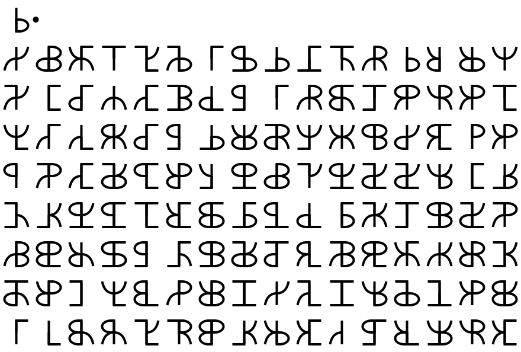

I blogged about these [in 2022](https://adam.scherlis.com/2022/10/28/cryptic-symbols/) and promised an explanation "soon". Here it is!

A fun notation for byte values:

{width="50%"}

But it looks a little nicer if you round things off:

In the usual notation, that's `03 . 24 3F 6A 88 85 A3 08 D3` and so on.

The angular form is somewhat inspired by Norse runes, especially [bind runes](https://en.wikipedia.org/wiki/Bind_rune). The round form is intended to be mistakable for as many Latin, Greek, and Cyrillic letters as possible.

I have since learned about [Cistercian numerals](https://en.wikipedia.org/wiki/Cistercian_numerals), which are a fun medieval take on the same concept.

## Code

As usual, there's a [messy notebook](https://github.com/AdamScherlis/notebooks-python/blob/main/codes/hexrunes.ipynb).